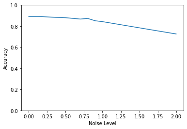

# Driver Identification Using Deep LSTM Network

While driving on your way to work, you come across a lot of other road users. More often than not, you can judge the way people drive from an outside perspective. Are they sticking to the right lane behind the trucks while going 80 km/h on the freeway, or are they that tail-gating german luxury car driver that really needs to pass you, even though you're already doing 20 km/h over the speedlimit? Considering that we as humans already can have somewhat of an indication of the driving style of people by simply sharing the road with them, what could a computer then achieve when it has access to the multitude of sensors available in a modern car? 

Automatically identifying the user of a car based on their driving style would come with a plethora of applications. It could for example be used to check if the owner of the car is the one actually driving which then could be used for theft prevention. Another possibility is to use this data for more specialised insurance plans, or one could image it to be used to judge the driving styles of people within a shared fleet of cars. 

Before we can look into these applications, first we need to know if it is even possible to correctly identify the current driver of a car. To test this, Girma, Yan and Homaifar have come up with a Deep LSTM based method of identifying drivers based on their driving style. In this blog we test their model by building our own implementation of it from scratch. We will take a look at the implementation they used, and see if it is as robust as they have claimed in the paper by performing comparable experiments to them. 

## The Data
Modern cars are all equiped with an On-Board Diagnostics (OBD) connector. OBD is a standard that has been implemented to make most diagnostic information available without the need for manufacturer specific hardware to have access to it. Via this connection, one can directly read most sensor output from the car. Which sensors are actually available still can depend on the make and model of the car, but most cars have a set of standard sensors. The paper uses two different datasets to test their model. One of these, the dataset used to test the model in this blog, is a set of 51 sensors, including, but not limited to: steering wheel input, engine RPMs, throttle input, car speed and fuel consumption. For a full list of sensors used, please see the extras section at the bottom of the page. 

The data used in this research was created by Il Kwak, Woo and Kang Kim (Know Your Master: Driver Profiling-based Anti-theft Method, 2016), and was generated by having ten different people make a round trip, and recording the sensor data from these drives. The data was then labeled based on the driver. This results in a set of timeseries data containing timesteps with 51 features each. 

## Why an LSTM?
A Long Short-Term Memory network, or LSTM for short, is a specialized form of neural networks. Like convolutional network is highly speciales for 2D image data, an LSTM is highly specialed for time series data. 

Since the sensor data is all collected with a set time interval, one sample after the other holds some interdependance and is order dependent. To illustrate the interdependance of the samples, consider the following example: When taking two consecutive samples, a car driving 10 km/h for the first sample and 0 km/h for the second sample probably came to a slow stop, while a car driving 50 km/h for the first sample and 0 km/h for the second sample had to do an emergency stop. The order for these samples then also has influence over the interpretation, as a car going from 50 to 0 is braking, while a car going from 0 to 50 is accelerating.

An LSTM is specifically designed to work with these properties of the data. Predictions made by the network are not only based on the current input, but also on a combination of a certain amount of previous inputs. Hence the name Long Short-Term Memory, as it remembers what has come before.

## Preparing the Data
In order to train the LSTM, the data must first prepared. As with most AI applications, in order to make the non-linearities of a neural network function properly, the inputs should be normalized to fit in a range of 0 to 1. 

After normalization, the data must be prepared for use within the LSTM. Since the LSTM depends on the history for an input to make its prediction, the samples fed to it during training should also have this history included. A single sample in this case would then consist of the input sample, along with a set amount of history input samples. This is done by applying a sliding window function across the input data as described in the figure below. 

<br>
*Figure 1: Overlap sliding window method between consecutive sequence
of data of feature 1 and 2*

With N being the total amount of samples and H being the size of the sliding window, this would then result in an input data size of shape [N, H, 51] as we have 51 features for each timestep. The labels for these samples are then encoded as a one-hot vector of length 10, as we have ten different drivers in the dataset.

## Building the model
Now that the data has been prepared, it is time to take a closer look at the model itself. The model conists of three different layers, of which two LSTM layers and one standard fully connected layer. The fully connected layer here uses a sigmoid activation function and is used to translate the output of the LSTM layers to a 10 length output vector, containing the probabilities for each driver based on the presented sample. The driver with the highest score in this vector is considered to be the chosen prediction.

The LSTM layers do the bulk of the work. The first layer has a hidden size of 160 and acts as the input layer for the network. This means that the input size of this layer should be adapted to the window size chosen during data preperation. The second layer conists of 200 hidden units and works directly on the outputs of the first layer. Because of this, it is important that the first layer also returns sequences. Using Keras as a deeplearning library, an implementation of this network would look something like this

```python
from tensorflow.keras import Sequential
from tensorflow.keras.layers import LSTM, Dense

model = Sequential()
model.add(LSTM(160, input_shape=(window_size, num_features), return_sequences=True ))
model.add(LSTM(200, ))

model.add(Dense(10, activation="sigmoid"))
```

## Training and Testing
Now that we created a simple version of the model, it is time to train it and analyze the results. For training, we first need to split the data in train and test subsets, for example by using `train_train_test_split` from `sklearn`. We chose a test size 0.1, which means 10% of the data will be used for the test set.

```python
from sklearn.model_selection import train_test_split
x_train, x_test, y_train, y_test = train_test_split(
    x_data, y_data[:], test_size=0.10
)
```

Training the model was done over 500 epochs with a batch size of 128, resulting in a training accuracy of over 97% percent. This looks promising, but does paint the full picture.

### Evaluating the Results
In order to get a better view of the realworld performance, one should always evaluate their model with data it has never seen before, in this case the data in our test set. This makes sure that you do not overfit to your training set, resulting in an exaggerated performance metric for your model. By evaluating over the test set, the real world accuracy drops to around 80%. 


### Noisey Data
The next evaluation step would be to compare our results to those of the authors of the paper. For this we first need to add different factors of noise to the input data. The authors of the original paper used white noise to emulate disturbances in the data coming from the sensors in a real world application, to test the robustness of their model. 

The noisey data is created by adding a layer of gaussian noise, with varying levels of standard deviation centered around 0, to the input data. This is then fed to the model, which tries to predict the driver. 

### Model Robustness 

Feeding the noisey data to our model results in the following graph. Here we see the accuracy compared to the standard deviation of the noise added. A higher standard deviation means a higher amount of noise, so the model has a harder time of recognizing the driver.

<div>
<br>
<em>Figure 3b: TODO.</em>
</div>

If we compare this result to that of the authors, we can see that they achieve significantly higher accuracies. 


### The Importance of Regularization 
In figure 2 we can see the results of the authors. One of the main things to notice, is the significantly higher accuracy achieved by their model. This prompts us to look back at our implementation and see where it can be improved.

<br>
*Figure 2: The accuracies of the paper's models for several standard deviations of Gaussian noise.*

One of the first things that comes to mind for improvement, is a case of overfitting. We achieve a high accuracy level during training, but in the validation step this drops of significantly. To combat the overfitting, we added some regularization measures. A dropout  layer was added as well as batch normalization layers. The new model now looks like this:

```python
model = Sequential()
model.add(LSTM(160, input_shape=(window_size, num_features), return_sequences=True ))
model.add(Dropout(0.5))
model.add(BatchNormalization())
model.add(LSTM(200, ))
model.add(BatchNormalization())
model.add(Dense(10, activation="sigmoid"))
```

Figure 3 now shows the results of this improved model. 


<br>
*Figure 3: Testing results of the model with some regularization methods applied*


### Cheating the System
Looking at figure 3, it is clear that there is still a lot of room for improvement compared to the model of the authors... or is there? 


// OUD STUK HIERONDER 


After training the model it is evaluated on the test data. Because sensor data would be expected to be noisy, the authors choose to disturb the test data with various levels of white noise before evaluation. This allows them to see how robust the model is to noise by seeing the accuracy dropoff. 
Our interpretation of how the noise was explained in the paper was that the amount of noise added should depend on the data variance, scaled by a factor between zero and two. However, when trying to recreate figures showing the noisy data, we found we actually needed to use that factor as the standard deviation directly, not use the data variance. 
We also found it to be important to only normalize the test data after adding the noise. Doing this the other way around resulted in a very strong dropoff in accuracy with increasing noise level. 

<br>
*Figure 2: The accuracies of the paper's models for several standard deviations of Gaussian noise.*
<div style="display: flex; width: 100%">
<div>

<br>
<em>Figure 3a: TODO.</em>

</div>
<div>


<br>
<em>Figure 3b: TODO.</em>

</div>
</div>

In the two figures above we see the results with increasing noise level for both the authors' LSTM and ours. We derived the noise levels tested by the authors from this graph and used the same ones. 

## Discussion
The first thing to notice from the results is that the slope of both figures is very similar. This means our model is similarly stable under the addition of noise, though it is slightly less accurate overall. We discuss why this may be below. 

### Comparing to authors code
In this section, we compare their code to their description in the paper and our implementation. During the creation of our reproduction, we have not looked at the authors' code in order to avoid influencing our work. After we finished our version, we looked at their code, which is available at [their github page](https://github.com/Abeni18/Deep-LSTM-for-Driver-Identification-). Unfortunately, we found this not to be very helpful.

We were unable to verify the structure of the model, since for their version the authors load an already trained model from an H5 file. This makes it impossible to compare the two versions. 

The unclear method for noise generation was already mentioned earlier in this blog. In the code, this method seems to be missing as well, having been rewritten for the creation of the anomaly plots further on in the paper. 

Though they say they use 10% of the data to test their model, they use a 15% split to evaluate the model. Furthermore, this test set is made after the already-trained model is loaded in and so it is not guaranteed to be fully distinct from the training set. We theorize that this may be why the authors achieve a higher accuracy than we do. When we evaluate our model on the training set instead of the test set at various noise levels, we see very similar results to those found in the paper. 


## Conclusion
The paper was true to its implementation in most aspects, though it was hard to evaluate the source code as it was incomplete. Nevertheless, we were able to create a reproduction that was similar in stability under noise to the original results, and deem this paper sufficiently reproducible.

---

# Appendices
## A. List of Features

*Table 1: Overview of features indices and their descriptions*

| Index | Description                                  |
| ----- | -------------------------------------------- |
| 0     | Fuel consumption                             |
| 1     | Accelerator Pedal value                      |
| 2     | Throttle position signal                     |
| 3     | Short Term Fuel Trim Bank 1                  |
| 4     | Intake air pressure                          |
| 5     | Filtered Accelerator Pedal value             |
| 6     | Absolute throttle position                   |
| 7     | Engine soacking time                         |
| 8     | Inhibition of engine fuel cut off            |
| 9     | Engine in fuel cut off                       |
| 10    | Fuel Pressure                                |
| 11    | Long Term Fuel Trim Bank 1                   |
| 12    | Engine speed                                 |
| 13    | Engine torque after correction               |
| 14    | Torque of friction                           |
| 15    | Flywheel torque (after torque interventions) |
| 16    | Current spark timing                         |
| 17    | Engine coolant temperature                   |
| 18    | Engine Idel Target Speed                     |
| 19    | Engine torque                                |
| 20    | Calculated LOAD value                        |
| 21    | Minimum indicated engine torque              |
| 22    | Maximum indicated engine torque              |
| 23    | Flywheel torque                              |
| 24    | Torque scaling factor(standardization)       |
| 25    | Standard Torque Ratio                        |
| 26    | Requested spark retard angle from TCU        |
| 27    | TCU requests engine torque limit (ETL)       |
| 28    | TCU requested engine RPM increase            |
| 29    | Target engine speed used in lock-up module   |
| 30    | Glow plug control request                    |
| 31    | Activation of Air compressor                 |
| 32    | Torque converter speed                       |
| 33    | Current Gear                                 |
| 34    | Engine coolant temperature                   |
| 35    | Wheel velocity front left-hand               |
| 36    | Wheel velocity rear right-hand               |
| 37    | Wheel velocity front right-hand              |
| 38    | Wheel velocity rear left-hand                |
| 39    | Torque converter turbine speed - Unfiltered  |
| 40    | Clutch operation acknowledge                 |
| 41    | Converter clutch                             |
| 42    | Gear Selection                               |
| 43    | Vehicle speed                                |
| 44    | Acceleration speed - Longitudinal            |
| 45    | Indication of brake switch ON/OFF            |
| 46    | Master cylinder pressure                     |
| 47    | Calculated road gradient                     |
| 48    | Acceleration speed - Lateral                 |
| 49    | Steering wheel speed                         |
| 50    | Steering wheel angle                         |

<style>
    .page-header {
        background: url('https://www.gannett-cdn.com/presto/2020/01/08/PDTF/34eb2a61-57e7-4dbf-81a4-03b872db0c73-GettyImages-1087233832.jpg');
    }

    .btn {
        color: rgb(255, 255, 255);
        background-color: rgba(0, 0, 0, 0.4);
    }

    .site-footer {
        display: none;
    }
</style>